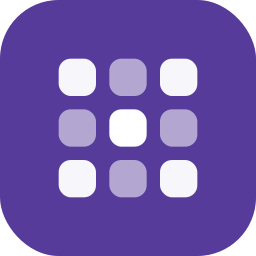

<br>
<br>
<br>
<br>
<p align="center">
  
</p>
<h1 align="center">YiDoku</h1>
<h3 align="center">Just another sudoku, simple yet focused.</h3>

<p align="center">A clean, lightweight, and privacy-first sudoku game, crafted with Material You and modern web engineering.</p>
<p align="center">Made with ❤️ by <a href="https://github.com/lingyicute">lingyicute</a>.</p>
<br>
<br>
<p align="center">
  [🇺🇸 English] •
  <a href="https://github.com/lingyicute/YiDoku">🌐 Source Code</a> •
  <a href="https://github.com/lingyicute/YiDoku/issues">🐛 Report Bug</a>
</p>

<p align="center">
  <a href="LICENSE"></a>
  <a href="index.html"></a>
  <a href="https://github.com/lingyicute/YiDoku"></a>
  <a href="https://github.com/lingyicute/YiDoku"></a>
  <a href="https://github.com/lingyicute/YiDoku"></a>
</p>
<br>

## 📖 Overview

Most sudoku sites fall into one of two camps: ad-stuffed portals that want an account before you can place a digit, or rigid grid pages that only know how to serve one fixed puzzle with no notes, no hints and no memory of what you were doing.

**YiDoku** takes the privacy-first, fully offline approach my H5 game family is known for. It is a complete sudoku implementation — generator, solver, pencil marks, hints, undo, statistics — shipped as **one self-contained HTML file**. Nothing is fetched from a server, nothing is tracked, and the whole game (down to the embedded typeface) works with the network switched off.

<br>

## ✨ Features

- **🧩 Real Sudoku, Generated on Demand**
  - Puzzles are built live by a bitmask solver with an **MRV heuristic**, never pulled from a fixed list.
  - Every clue is removed only while a uniqueness check still reports **exactly one solution** — so every puzzle is solvable by logic, never by guessing.
  - New grids appear in milliseconds, which makes "restart" and difficulty-hopping effortless.

- **🎚️ Four Difficulty Tiers**
  - **简单 Easy** (40 clues), **中等 Medium** (32), **困难 Hard** (28), **专家 Expert** (24).
  - Switch tiers from the chips below the board; progress in the current game is protected by a confirmation dialog.

- **✍️ The Quality-of-Life Features You Actually Want**
  - **Notes / pencil marks** — track candidates per cell; the selected digit is highlighted inside every note grid.
  - **Hint** — auto-fills one correct digit, and the number of hints you spent is recorded.
  - **Undo** — full move history.
  - **Mistake tracking** — digits that contradict the solution are flagged and counted, so you always know how clean the solve was.
  - **Smart highlighting** — selecting a cell tints its row / column / box peers, the matching digit and every equal digit on the board.
  - **Digit pad with bookkeeping** — each digit shows how many of its nine are still unplaced and dims out when complete.
  - **Auto-save & resume** — the board, timer and notes are saved as you play and restored when you come back.

- **📊 Statistics per Difficulty**
  - Games completed and **best time** tracked separately for every tier.
  - A summary dialog after each win: time, mistakes, hints and a "new record" callout when you beat your best.

- **🎨 Material You & Polished Design**
  - **Dynamic theming in the browser**: pick one of **eight accent hues**, and a full Material token set — surfaces, containers, primary, outlines, error roles, board and cell colours — is derived from it.
  - **Day / Night mode** (system, light or dark) with the initial choice taken from `prefers-color-scheme` and `<meta name="theme-color">` kept in sync for mobile browser chrome.
  - Optional motion, fully respectful of `prefers-reduced-motion`.

- **🔒 100% Privacy, Offline & Ad-Free**
  - **Zero network requests** — no analytics, no fonts, no CDN, no backend.
  - Records and preferences stay in the browser's `localStorage` (`yidoku:*`); clearing them is one menu item.
  - Licensed under **AGPL-3.0**.

- **♿ Built to Be Usable**
  - Full keyboard control (`↑ ↓ ← →`, `1`–`9`, `N`, `H`, `Z`) alongside tap / click.
  - ARIA grid semantics, labelled controls, focus-visible outlines, and a layout that scales itself down on very narrow screens so nothing ever overflows.

<br>

## 🛠️ Why YiDoku? (Under the Hood)

### 1. A Sudoku Engine, Not a Puzzle Database
The generator and the solver are the same routine. Candidate sets are 9-bit masks, a precomputed popcount table makes minimum-remaining-values selection cheap, and the solver is asked to run twice during generation: once to fill a random complete grid, and once more after each clue removal to confirm the puzzle still has exactly one answer. That is what makes the difficulty tiers meaningful — "Expert" means *fewer givens on a uniquely solvable grid*.

### 2. Material You Dynamic Theming in the Browser
There is no Android framework to hand out a wallpaper palette here, so YiDoku builds its own: each of the eight accents is a single hue, and the page computes light and dark tonal ramps from it at runtime, writing the results onto `:root` as CSS custom properties. The board colours participate too, so the whole grid — givens, peers, the selected digit — retints coherently instead of just flipping a toggle.

### 3. Local-First, Zero-Network Architecture
Everything the page needs is inside `index.html`: markup, styles, game logic, icons and a base64-embedded subset of the "Nebulove" typeface. There is no fetch, no import and no external stylesheet in the file, so it runs identically from `file://`, from a static host, or on a plane. State lives in `localStorage` and is written on every change and on `beforeunload`; nothing is ever uploaded.

<br>

## 🚀 Play It Now

There is nothing to install — the game *is* one HTML file.

### Option 1 — Just open it
Download `index.html` (or clone the repository) and double-click the file. Everything, font included, is embedded, so it works straight from disk with no local server.

### Option 2 — Serve it locally
```bash
git clone https://github.com/lingyicute/YiDoku.git
cd YiDoku
python3 -m http.server 8000     # then open http://localhost:8000
```

### Option 3 — Publish it anywhere
Drop `index.html` on GitHub Pages, Cloudflare Pages, Netlify, Vercel, a static bucket or your own nginx — a single file is the entire deployment, and there is no build output to configure.

## 🔨 Building from Source

There is no build step: `index.html` is the source *and* the artifact.

1. **Clone the repository**:
   ```bash
   git clone https://github.com/lingyicute/YiDoku.git
   cd YiDoku
   ```

2. **Edit and reload** — open `index.html` in your editor of choice and refresh the browser. The file is organised with banner comments (`/* ---------- 数独核心 ---------- */`, `/* ---------- 状态 ---------- */`, …) so the solver, the state layer and the render layer are easy to find.

3. **Ship it** — commit and push. If GitHub Pages is enabled for the repository, the new build is live as soon as the branch updates.

<br>

## 🤗 Contributing

Contributions are always welcome!
- **Bug Reports & Feature Requests**: submit an issue on the [GitHub Issue Tracker](https://github.com/lingyicute/YiDoku/issues).
- **Pull Requests**: keep the single-file philosophy intact — no runtime dependencies, no build step — and match the existing code style.
- **Translations**: the interface is currently Simplified Chinese. An i18n layer plus translated string tables would be a great first contribution.

<br>

## 📄 License

```text
Copyright (C) 2026 lingyicute <li@92li.uk>

This program is free software: you can redistribute it and/or modify
it under the terms of the GNU Affero General Public License as published by
the Free Software Foundation, either version 3 of the License, or
(at your option) any later version.

This program is distributed in the hope that it will be useful,
but WITHOUT ANY WARRANTY; without even the implied warranty of
MERCHANTABILITY or FITNESS FOR A PARTICULAR PURPOSE. See the
GNU Affero General Public License for more details.

You should have received a copy of the GNU Affero General Public License
along with this program. If not, see <https://www.gnu.org/licenses/>.
```
